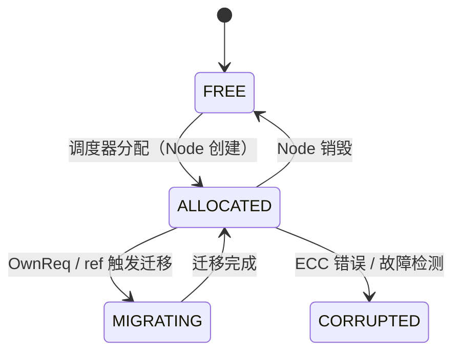

# EDSOS 内存子系统架构文档草稿

## 1. 引言

### 1.1 设计愿景
- 显式分布式（Explicitly Distributed）
- 局部自组织，全局稳态
- 统一控制流、数据流、作用域、位置与生命周期

### 1.2 核心抽象
- Arbor Strux (AS) 进程模型
- 三层本体论：PP（物理） / VP（协议） / Node（逻辑）

---

## 2. 物理层

物理层是 EDSOS 内存子系统的底层基石，负责管理物理存储设备（如 DDR5 DRAM、NVMe SSD）上的原始存储单元。其核心目标是：**以极低开销提供可扩展、可靠、硬件友好的物理页管理能力**，同时为上层虚拟页（VP）的“盛装”（Containment）关系提供支撑。

### 2.1 PP 的本体论

**物理页**（Physical Page, PP）是物理层的基本单元，定义为存储设备上固定大小的连续存储块。PP 本身**无生命周期、无归属、无语义**——它仅是一个“容器”（井），用于盛装一个虚拟页（VP）。

- **PP 不主动管理内容**：其状态完全由外部元数据描述。
- **盛装关系**：一个 VP 在稳态下仅盛装于一个 PP；迁移过程中可短暂处于“双盛装”状态，由一致性协议保证外部观察一致性。
- **设备绑定**：PP 严格隶属于单一物理存储设备（如某条 DDR5 DIMM 或某块 SSD），**段落划分不会跨越不同物理设备**。

> **设计哲学**：PP 的“无头”特性使其成为纯粹的资源池，调度器可自由分配、迁移、回收，而无需修改 PP 本身。

### 2.2 Near-Storage Metadata（NSME）

每个 PP 均由一条 **Near-Storage Metadata Entry **(NSME) 描述其状态与拓扑属性。NSME 采用 **8 字节**（64 位）紧凑结构，布局如下：

| 字段 | 位宽 | 说明 |
|------|------|------|
| `state` | 6 bits | 状态：`FREE=0`, `LOCKED=1`, `CORRUPTED=2`, `RELIABLE=3`, `RESERVED=4`, … |
| `next_free_log2` | 6 bits | 空闲链表跳跃步长提示（log₂尺度） |
| `jump_hint_prev` | 19 bits | 分层空闲链表前驱指针差值（保守近似） |
| `jump_hint_next` | 19 bits | 分层空闲链表后继指针差值（保守近似） |
| `ded` | 1 bit | 奇偶校验位，供硬件快速校验 NSME 完整性 |
| `zone_token` | 4 bits | 分区标识，用于优化 NUMA 或存储类型（DRAM/SSD）访问 |
| `reserved` | 9 bits | 预留位，用于安全标签、压缩状态、ECC 模式等未来扩展 |

NSME 支持基于 *Conservative Logarithmic Jump Hints* 的 O(log d) 分配/释放算法，其中跳跃指针为保守近似（计算位置 ≤ 真实位置），确保单向线性探测即可完成查找。

### 2.3 段落化存储布局

为高效组织 NSME 并消除指针开销，物理内存按 **段落**（Segment）划分：

- **段落大小**：逻辑上为 **2 GB**（\(2^{31}\) 字节）。
- **元数据区**：段落起始的 **4 MB**，由两页（2 × 2 MB）组成，称为**元数据页**。
- **数据区**：后续 \(2\,\text{GB} - 4\,\text{MB}\) 空间，按设备页大小划分 PP。
- **索引机制**：元数据页中偏移 \(i \times 8\) 处的 NSME **直接对应**段内第 \(i\) 个 PP，无需存储物理地址指针。

#### 2.3.1 DRAM 段落
- PP 大小：**4 KB**（与 CPU 页对齐）。
- 数据区 PP 数量：\( (2\,\text{GB} - 4\,\text{MB}) / 4\,\text{KB} = 523{,}264 \)。
- 元数据页可容纳 \(2^{19} = 524{,}288\) 条 NSME，**预留约 1,024 条空间**用于：
  - 段级元信息（如段锁、用途标签、硬件信息）；
  - 跨段索引（如空闲段链表）；
  - 对齐物理容量（考虑存储厂商使用 1000 进制）。

#### 2.3.2 SSD 段落
- PP 大小：**16 KB**（匹配 SSD 写粒度）。
- 数据区 PP 数量相应减少，元数据页中**预留更多空间**。
- **写放大优化**：由于单条覆盖 16 KB 的设计用不完 2 MB 元数据页，通过轮换使用不同子区域存储 NSME 更新，**分散写入压力**，延长 SSD 寿命。

#### 2.3.3 尾段处理
- 若物理设备容量非 2 GB 整数倍，则末尾形成**不完整段落**（尾段）。
- 尾段采用**简化元数据管理**：
  - 元数据页按比例缩小；
  - 空闲链表退化为线性扫描（因规模小，性能可接受）。

> **重要说明**：段落仅为 NSME 组织单位，**不构成上层管理边界**。例如，1 GB 大页可跨越两个段落，只需同时更新两个段落中的对应 NSME。此操作仅引入微量额外访存延迟，不影响正确性。

### 2.4 元数据可靠性与容错

- **硬件 ECC 为主**：NSME 与 PP 数据均依赖存储设备自身的 ECC 机制（如 DDR5 On-Die ECC、SSD LDPC）。
- **软件 ECC 为辅**：默认关闭；若强制启用，需**额外划分专用物理区域**存储校验码，系统不预留默认空间。
- **元数据页备份**：
  - 关键段落的元数据页可配置**备份副本**；
  - 备份位置可**集中存放**（如专用元数据区域）或**随机分散**（提高故障隔离性）；
  - 通过段头预留字段中的**指针**访问备份，仅在主元数据页校验失败时启用。

### 2.5 物理内存管理策略

- **使用/释放**：由调度器驱动，基于 NSME 的分层跳跃链表实现 O(log d) 时间复杂度。
- **无全局回收器**：PP 释放仅由显式调度决策触发，避免隐式 GC 带来的延迟不确定性。
- **PPSUC 硬边界**：每个物理机（PM）的物理容量存在上限（Physical Paged Storage Unit Capacity），**禁止跨 PM 借用 PP**，保障局部性与性能可预测性。
- **故障处理**：PP 因 ECC 错误或校验失败被标记为 `CORRUPTED` 后将被隔离，不再参与分配。

---

## 3. 虚拟地址空间模型

### 3.1 全局虚拟地址（GVA）

全局虚拟地址（Global Virtual Address, GVA）是 EDSOS 内存子系统中用于在集群范围内唯一标识一个**可跨物理机（PM）访问的虚拟页（VP）** 的 128 位逻辑标识符。GVA 的设计遵循“显式分布式”原则：**仅当 VP 具备跨 PM 可见性（例如被远程引用、共享或迁移）时，才为其分配 GVA**；本地私有 VP 无需 GVA，从而避免不必要的全局命名开销。

GVA 与局部虚拟地址（LVA）共同构成 EDSOS 的两级地址模型：
- **LVA** 是 AS（Arbor Strux 进程）内部的 64 位虚拟地址，用于 CPU 执行和指针操作，始终与具体 PM 绑定；
- **GVA** 是集群范围内的逻辑 ID，用于 DPU 执行一致性协议、远程访问和故障恢复。

二者通过“**局部连续映射**”关联：对于同一个 VP，其 GVA 与 LVA 在偏移上保持一致，即  
\[
\text{GVA}_{\text{ptr}} = \text{GVA}_{\text{base}} + (\text{LVA}_{\text{ptr}} - \text{LVA}_{\text{base}})
\]  
这一约束确保了应用程序在进行指针算术时，可安全地将本地 LVA 转换为 GVA 用于 DPU 通信，而不会破坏程序语义。GVA 与 LVA 的生命周期和分配策略完全解耦——LVA 在 AS 创建时分配并保持稳定，而 GVA 按需延迟分配。

#### 2.1.1 GVA 结构与分配策略

GVA 采用如下 128 位结构：

```
[ RefIdx:16 ][ Free Bits:112 ]
```

其中：
- **`RefIdx`（16 位）**：标识该 GVA 所指 VP 的副本索引。`RefIdx = 0` 表示正本（canonical copy），`RefIdx > 0` 表示副本（ref copy）。该字段由 DPU 在 `ref` 操作时分配，**不携带物理位置信息**。
- **`Free Bits`（112 位）**：用于编码 VP 的逻辑身份。其内部结构*指导性地*划分为：
  ```
  [ initPMID:16 ][ LocalGVA:96 ]
  ```
  - **`initPMID`**：建议的初始归属 PM ID，仅用于**减少 GVA 分配时的全局竞争**。分配器优先在当前 PM 的 `initPMID` 范围内尝试分配；若失败，则可跨范围搜索。**该字段不决定 VP 的实际位置**。
  - **`LocalGVA`**：高位逻辑偏移，通常与 LVA 的高位对齐，以支持局部连续映射。

> **重要说明**：GVA 的比特布局**不编码物理位置**。任意 GVA 的真实归属 PM 由其对应的 **GVA NSME（Namespace Metadata Entry）** 中的 `pmid` 字段动态指示。这一设计实现了命名与位置的彻底解耦，支持 VP 的任意迁移而无需修改 GVA。

#### 2.1.2 GVA NSME：自引导的分布式元数据

每个 GVA 都关联一个 **GVA NSME**，用于描述其状态、大小、归属及分配拓扑信息。GVA NSME 本身也存储在 GVA 地址空间中，形成**自引导（self-bootstrapping）的元数据结构**。

GVA NSME 的格式如下：

| 字段 | 位宽 | 说明 |
|------|------|------|
| `state` | 4 bits | VP 状态：`FREE` / `ALLOCATED` / `RESERVED` / `OTHER` |
| `pmid` | 16 bits | 当前 VP 的页表项（PTE）所在 PM 的 ID |
| `next_diftype_log2` | 7 bits | 主空间跳跃步长提示 |
| `diftype_jump_hint_prev` | 14 bits | 主空间分层链表前驱指针差值（保守近似） |
| `diftype_jump_hint_next` | 14 bits | 主空间分层链表后继指针差值（保守近似） |
| `frefidx_jump_hint_prev` | 3 bits | 空闲 RefIdx 链表前驱指针差值（保守近似） |
| `frefidx_jump_hint_next` | 3 bits | 空闲 RefIdx 链表后继指针差值（保守近似） |
| `lock` | 3 bits | 轻量自旋锁（1 bit） + 争用标记（2 bit） |

##### 跳跃指针的保守近似机制
为支持高效遍历（分配/释放），GVA NSME 使用**保守近似指针**：
- **主空间跳跃**（14 位）：采用混合编码 `(k:11, t:3)`，近似指针值为 \((2^k) \times 2^{(2^t)}\)，用于索引一个 GVA NSM Page（含 \(2^{19}\) 个 VP）。
- **空闲 RefIdx 跳跃**（3 位）：编码为 \(s\)，近似指针值为 \(4^{(2^s)}\)。

所有跳跃均为**指针差值**，且为**保守近似**：计算出的位置 ≤ 真实目标位置。因此，查找时只需**同向线性探测**，永不需反向回溯，保证正确性和逻辑简洁性。

##### 自引导访问流程
系统启动时，预分配若干 GVA NSM Page（元数据页），其 GVA 和初始 `pmid` 由引导程序固化。访问任意 GVA 的 NSME 时：
1. 用 GVA 的高位计算其所属 NSM Page 的 GVA；
2. 递归解析该 NSM Page 的 NSME，获取其 `pmid`；
3. 向 `pmid` 对应的 PM 发起 DPU 读请求；
4. 目标 PM 的 DPU 返回具体 NSME 条目。

该过程完全分布式、无中心目录，且支持惰性 GPA 映射（NSME 的 PTE 可标记为缺页，由调度器按需填充）。

#### 2.1.3 GVA 与 LVA 的局部连续性约束

为保障应用语义正确性，EDSOS 强制要求：**同一段连续的 VPs 内，GVA 与 LVA 必须保持相同的偏移关系**。这意味着：
- 编译器生成的指针（基于 LVA）可在运行时安全转换为 GVA；
- DPU 插桩代码可直接使用 `(GVA_base + offset)` 定位远程数据；
- 无需修改应用逻辑即可支持分布式共享。

该约束由加载器和调度器协同保证：
- 加载器为 AS 分配连续 LVA 空间；
- 调度器在首次 `ref` 时，按 LVA 基址对齐分配 GVA；
- 后续 fork/divide 操作保持 LVA 布局稳定，从而维持 GVA-LVA 映射一致性。

#### 2.1.4 GVA 生命周期与故障恢复

- **分配**：由调度器在 VP 首次跨 PM 引用时触发，通过 GVA NSME 的空闲链表分配。
- **释放**：当所有 `ref` 被 `unref` 且 VP 销毁时，NSME 状态置为 `FREE`，加入空闲链表。
- **故障恢复**：若 `pmid` 所指 PM 失效，DPU 通过心跳超时检测故障，并触发：
  1. 自动清理失效路径（`dpu_cleanup_pm_refs`）；
  2. 副本 PM 票选新 owner_pm；
  3. 新 owner 更新 NSME 的 `pmid` 字段，完成元数据接管。

GVA 本身在故障中保持不变，确保引用透明性。

---

### 3.2 局部虚拟地址（LVA）

局部虚拟地址（Local Virtual Address, LVA）是 EDSOS 中 **CPU 执行视角下的唯一地址空间**。它采用标准的 64 位虚拟地址格式，由本地 MMU 通过多级页表（PTE）翻译为局部物理地址（LPA），完全兼容 x86-64 或 ARM64 的地址转换机制。LVA 的设计目标是在保留经典 OS 编程模型的同时，支撑 AS（Arbor Strux 进程）的节点语义、作用域隔离与多核并行执行。

#### 3.2.1 LVA 的基本语义与约束

- **AS 私有性**：每个 AS 拥有独立的 LVA 空间，由 CR3 寄存器指向其根页表。不同 AS 的 LVA 空间彼此无关——即使数值相同，也无任何语义关联。切换 AS 即切换 CR3。
- **节点连续性**：一个 Node（节点）内的所有 VP（元数据 R / 指令 RX / 数据 RW）必须分配在**连续的 LVA 区域**中。这是为了：
  - 支持编译器生成的相对跳转与数据偏移；
  - 保证指针在 AS 内部的可传递性；
  - 便于子树作用域的页表隔离（通过 PTE 的 Present 位控制）。
- **稳定性要求**：LVA 在 AS 生命周期内**不可回收、不可重用**。应用指针长期有效，避免悬空指针。
- **地址宽度**：最大有效地址宽度为 57 位，足以满足长期应用需求。

> LVA 是“执行视图”，其存在不依赖 GVA；仅当 VP 需跨 PM 访问时，才为其分配 GVA。

#### 3.2.2 LVA 的分配与空闲管理

LVA 的分配由调度器在 AS 创建和 Node 操作时触发。分配器需满足：
- 对齐节点粒度（通常 ≥ 4KB）；
- 保证节点内三段连续；
- 节点间插入至少一个 4KB 大小的空洞，防止越界访问。

为高效管理 48/57 位地址空间的空闲区域，EDSOS 引入 LVA NSME 作为地址区间的轻量元数据。与 Linux 的 VMA（Virtual Memory Area）rbtree 不同，LVA NSME 采用**分层跳跃链表**结构，支持相同的 O(logN) 的空闲查找与合并。

#### 3.2.3 LVA NSME：地址空间的元数据

LVA NSME 是 **64 位（8 字节）** 的紧凑结构，**描述一段 LVA 区间的生命周期与拓扑属性**。它与 PTE **互补而非重复**：
- **PTE** 描述“Page”：映射到哪个 LPA、权限、是否大页、是否在 SSD；
- **NSME** 描述“Address”：该地址段是否被占用、是否可分配、拓扑关系。

LVA NSME 的字段定义如下：

| 字段 | 位宽 | 说明 |
|------|------|------|
| `state` | 4 bits | 地址段状态：<br>`0=FREE`, `1=LOCKED`（分配中）, `2=CORRUPTED`, `3=RELIABLE`, `4=RESERVED` |
| `next_diftype_log2` | 6 bits | 主跳跃步长提示（用于分层空闲链表） |
| `jump_hint_prev` | 19 bits | 分层链表前驱指针差值（保守近似） |
| `jump_hint_next` | 19 bits | 分层链表后继指针差值（保守近似） |
| `lock` | 2 bits | 轻量自旋锁（用于 PM 内多核并发分配） |
| `flags` | 6 bits | 扩展标志位（因 PTE OS 保留位有限，用于：<br>• `IS_NODE_BOUNDARY`<br>• `SSD_BACKED_HINT`<br>• `NO_REF`（禁止跨 PM 引用）） |
| `counter` | 8 bits | 性能计数器（如访问热度、缺页次数，供调度器驱逐决策） |

##### 关键设计原则：
1. **不记录页大小**：页大小（4K/2M/1G）是 PTE 的职责，NSME 仅关心“这段地址是否整体被使用”。
2. **保守跳跃指针**：`jump_hint_prev/next` 为指针差值，且为保守近似（≤ 真实值），确保查找时只需同向线性探测。
3. **多核安全**：`lock` 字段保护 NSME 修改，因同一 AS 可能被调度到多个 CPU Core 并行执行。
4. **性能可观测**：`counter` 支持调度器实现基于热度的驱逐策略。

#### 3.2.4 LVA 与页表（PTE）的协同

LVA 的物理映射完全由标准 PTE 完成。EDSOS 利用 PTE 的 **OS 保留位**（如 x86-64 的 bit 58–62）扩展语义：
- `IN_SSD`：LPA 位于 SSD，访问需特殊路径；
- `SUBTREE_ROOT`：该 PTE 对应子树根，用于作用域切换时的增量页表更新；
- `CARN_REF`：该 VP 是 CARN 的一部分，允许多 AS 共享写入。

> 注意：PTE 描述的是“Page”的属性，而 NSME 描述的是“Address 区间”的属性。例如，一个 2MB 大页对应一个 PTE，但会跨越多个 NSME 条目（每个条目对应一段 4KB 区域）。

---

### 3.3 虚拟页（VP）本体论

在 EDSOS 内存子系统中，**虚拟页（Virtual Page, VP）** 是承载数据的**基本逻辑抽象单元**。它不是物理实体，而是一个具有明确身份、状态和行为语义的**抽象对象**。VP 的存在独立于其物理载体（PP），也独立于其索引方式（LVA 或 GVA），但必须依附于二者才能实在并被访问。

#### 3.3.1 VP 的本质：数据的抽象对象

VP 的核心定义如下：

> **VP 是一段固定大小（4K/2M/1G）的、具有全局可识别身份的纯粹抽象对象。它不包含执行语义，仅作为数据的抽象。**

关键特性：
- **身份唯一性**：一个 VP 在其所属 AS 的上下文中由 `{ASID, LVA}` 唯一标识；若具备跨 PM 可见性，则额外拥有一个 GVA。
- **无内建引用计数**：VP 本身**不存在传统意义上的引用计数**。它的存在性是二元的：
  - **不存在/未分配**；
  - **存在且唯一**（已分配并归属于某个 Node）。
- **绑定于单一 AS**：每个 VP 严格隶属于一个 AS，不可跨 AS 共享——除非通过 **CARN（Cross-AS Referring Node）** 机制显式创建副本。

> **哲学澄清**：VP 不是“资源”，而是“对象”。它的“使用”不是通过增加 refcount，而是通过**创建副本**或**获取正本访问权**来实现。

#### 3.3.2 双重视图：LVA 与 GVA 对 VP 的嵌入

VP 本身无地址，但可通过两种正交视图被“嵌入”到地址空间中：

| 视图 | 使用者 | 作用 | 是否必需 |
|------|--------|------|----------|
| **LVA** | 本地 CPU | 执行视角下的索引，用于本机读写 | 是（所有 VP 必有 LVA） |
| **GVA** | DPU | 分布式视角下的索引，用于远程访问 | 否（仅当 VP 跨 PM 可见时分配） |

- **LVA 视图**：将 VP 嵌入 AS 的私有虚拟地址空间，形成连续节点布局；
- **GVA 视图**：将 VP 嵌入集群级逻辑命名空间，支持路径缓存与一致性协议。

二者**不绑定 VP，而是从不同维度索引同一个 VP 实例**。这种设计类似于数学中将一个抽象流形嵌入到不同坐标系（\(\mathbb{R}^n\)）中——VP 是流形本身，LVA 和 GVA 是两种坐标卡（chart）。

> **重要推论**：修改 LVA 映射（如重映射到 SSD）或 GVA 路由（如迁移 owner_pm）**不改变 VP 本身**，仅改变其访问路径。

#### 3.3.3 盛装关系：VP 与 PP

VP 必须依附于物理实体才能实在并被访问，这一关系称为 **盛装（Containment）**：

- **PP（Physical Page）** 是物理存储的最小单位（DDR 或 SSD 中的一段连续内存）；
- **一个 VP 在任意时刻（除迁移瞬态）仅盛装于一个 PP**；
- **VP 的副本各自盛装于不同的 PP**，彼此物理隔离。

##### 迁移语义
“VP 迁移”是**将其盛装关系从一个 PP 切换到另一个 PP**，这通过 GVA 和 LVA 的重映射实现：
1. 源 PM 将 VP 数据传输至目标 PM；
2. 更新 GVA NSME 的 `pmid` 字段；
3. 使源 PM 的 LVA PTE 标记为缺页；
4. 目标 PM 建立新的 LVA → LPA 映射；
5. DPU 路径缓存更新（通过 `PCEReq`/`PCEAck`）。

> **边界情况**：在迁移完成前，VP 处于“双盛装”瞬态（源 PP 仍有效，目标 PP 已写入），但一致性协议确保外部观察者只能看到一致状态。

#### 3.3.4 副本机制与一致性

VP 支持创建**副本（ref copy）**，以实现跨 PM 共享或负载迁移。副本的关键属性：
- **依附于正本**：副本的语义合法性由正本（RefIdx=0）保证；
- **独立身份**：每个副本拥有**独立的 LVA（在目标 AS 中）和 GVA（RefIdx > 0）**；
- **数据一致性**：由双协议保障：
  - **路径缓存协议**：最终一致性，支持乐观读写；
  - **所有权协议**：强一致性，用于锁或迁移场景。

> **澄清误区**：副本不是“引用”，而是**新的 VP 实例**，只是其数据内容与正本保持同步。

#### 3.3.5 VP 与 AS/Node 的结构关系

VP 是构建 AS 地址空间的**原子砖块**，其语义由更高层结构赋予：

| 结构 | 与 VP 的关系 |
|------|-------------|
| **AS Node（节点）** | VP 的组织单元；一个 Node 包含若干**连续 LVA 的 VP**（R/RX/RW 三段） |
| **CARN（Cross-AS Referring Node）** | 唯一允许跨 AS 共享的 Node 类型；其 VP 可被其他 AS `ref` 创建副本 |

- **VP 无结构语义**：单个 VP 不知道自身属于哪个 Node，也不知是否为 CARN；
- **结构语义由调度器维护**：Node 的元数据记录其 VP 范围、类型、共享策略；
- **VP 生命周期 = Node 生命周期的一部分**：Node 销毁 → 其所有 VP 标记为 FREE → LVA NSME 回收。

> **设计原则**：VP 是“无头”的数据页，结构由 Node 赋予，分布由 DPU 管理。

#### 3.3.6 VP 的状态机

VP 在其生命周期中经历以下状态（由 GVA NSME.state 或 LVA NSME.state 描述）：



- **ALLOCATED**：VP 存在，盛装于某 PP，可被访问；
- **MIGRATING**：瞬态，数据正在拷贝，访问可能阻塞或重定向；
- **CORRUPTED**：不可恢复错误，需上层处理（如重启 AS）。

---


## 4. 协议层

### 4.1 路径缓存协议

- 适用场景: 高频读优化、乐观并发共享、页范围原子操作
- 机制: 
  - 控制流的分支迁移到另一个 PM, 随之带来进程空间的扩张
  - 数据流伴随控制流迁移, 新 PM 触发 `ref` 并拷贝获取整个 VP, 在 `ref` 建立过程中建立路径缓存
  - 路径缓存的 MidPoint 缓存 (保存在沿路的 DPU 中) 包括 VP 的正本 GVA, 归属的副本 bit_map, HostPoint 方向最近一跳, EndPoint 方向最近一跳; HostPoint 缓存额外包括归属副本 bit_map 所对应的 PM; EndPoint 缓存额外包括正本所在的 PM
  - 分布式自动路由: 完全通过路径缓存记录下对应于 VP 的一致性消息的路由方向, 由路径缓存解析器 (PCAU, Path Caching Analysis Unit) 负责解析, 不需中心目录, 只需 GVA 即可自动导向正确的 PM
  - 版本与确认: `RefReq` / `RefAck` 及其他成对指令对应携带相同的由新 PM 生成 (在新 PM 范围内单调增) 的Transaction ID, 旧 PM 在 `RefReq` 时缓存, 在 `RefAck` 时删除; 同时指令携带 TTL, 超时废弃并报告
  - 新 PM (非 owner_pm) 触发写操作时, `SWReq (Submit Write)` 指令伴随 Write-Update 沿缓存路径传播到达 owner_pm, owner_pm 触发 `WUReq` (对于小数据) 或 `WIReq` (对于大数据) 携带触发者的 bit_map, 由 PCAU 自动向其他副本转发 & 向触发者返回 `SWAck`, 仍由 PCAU 自动缓存 Transaction ID 并在其他副本全部返回 `WUAck` / `WIAck` 时向主机返回 `WUAck` / `WIAck`
  - 旧 PM (owner_pm) 触发写操作时, 直接触发 `WUReq` (对于小数据) 或 `WIReq` (对于大数据); 这里实际上意味着 owner_pm 类似于 MESIF 中的 Forward
  - 任何非 owner_pm 触发读操作时需要检查是否有 `Invalid` 标记, 如果是则触发 `ReadReq` 从 owner_pm 处读取得到*已知最新*的版本; 不对数据 (VP) 本身记录版本, 只对一致性协议消息记录版本
  - 当控制流退出一个 PM 时, 进程空间随之收缩, 触发 `UnrefReq` 自动清理路径, 但必须等待 `UnrefAck` 才能安全退出

### 4.2 所有权协议

- 适用场景: 实现强一致性读写 / 分布式锁 / 迁移
- 机制: 
  - 请求: 在建立了基于路径缓存的 `ref` 之后, 控制流可以主动触发 `OwnReq`; 当旧 owner_pm 发现自己不再是 owner_pm 时, 也可以根据对应的 Config Tag 寄存器在要求 "始终按照所有者身份读写" 时自动触发 `OwnReq`; 触发之后请求者需要锁定本地的副本 VP, 拒绝新的 store
  - 仲裁: `OwnReq` 到达当前 owner_pm 后触发仲裁流程, 仲裁主要基于指令传播到达的先后顺序（包括自竞争指令）; 只有当多个指令在同一个时钟周期同时到达时, 根据可交换标识 & 租期状态 / 优先级 / 公平防饿 / 端口序号仲裁出归属; 不论是否获得所有权, 都会*立即*（固定的时钟周期数量）返回一个响应 (`OwnAck` / `OwnFail`); 仲裁发生在当前 owner_pm, 它拥有最高的权限, 可以将一个指定的寄存器置高来声明处于"不可被换出状态", 但是这个状态会在DPU内硬件计时, 不可超出上限, "超出上限主机未响应"是一个触发报告主机故障的场景
  - 所有权与数据迁移: 当 owner_pm 的仲裁器给出仲裁允许转移和请求方收到 `OwnAck` 时, 各自向 PCAU 提交一个 `Stall`, 一切在此期间到达的 VP 一致性消息都临时写入缓存等待; 同时 owner_pm 并行地在主机本地对 LVA 标记缺页; 请求方在收到 `OwnAck` 时消息附加完整的正本内容, 直接 DMA 写入原副本 VP 对应的 PP中; 接收完成 (接收字节量 & ECC 校验) 后请求方返回 `ROAck (Receive Owning)`, 附带完整的旧副本元数据
  - 元数据确认与路径缓存更新: 原 owner_pm 收到 `ROAck` 后更新本机的 GVA 和 LVA 页表项, 并重置与 owner_pm 相关的寄存器, 完成后发送一个特殊的 `PCEReq (Path Caching Exchange)` 要求 MidPoint 中的路径缓存交换方向并附带 HostPoint 所需的额外数据; 请求方收到 `PCEReq` 说明路径缓存的 MidPoint 更新完成, 触发 `PCEAck` 附带 EndPoint 的额外数据, 交换双方的 HostPoint / EndPoint 标记, 消除 PCAU 的 `Stall`, 恢复运行
- 约束：
  - 防止未完成写或本机原子操作期间转移
  - 防止转移期间写
  - 防止租期内转移

---

## 5. 逻辑层

### 5.1 AS 生命周期
- 创建：初始化 LVA 空间元数据（页表基址）
- 销毁：释放 LVA 元数据，触发所有 VP unref

### 5.2 节点语义
- **三段结构**：元数据（R）、指令（RX）、数据（RW）
- **定义域**：可访问的 VP 集合（自身 + 祖先）
- **作用域**：自身 VP 可被哪些节点访问
- **引用计数**：仅 CARN/SCN 具备

### 5.3 fork 与 divide/merge
- **fork**：复制 LVA 布局，共享 VP（含 CARN 引用 +1）
- **divide/merge**：重映射 LVA，VP 盛装关系可保留或重定向

---

### 4.3 共享机制

#### 4.3.1 CARN（Cross AS Referring Node）
- **唯一可跨 AS 共享的节点类型**
- **引用计数**：由 CARN 元数据维护
- **一致性**：
  - 同 PM：链式消息总线 或 硬件原子锁（显式调用）
  - 跨 PM：DPU 路径缓存 / 所有权协议（显式桩函数）

#### 4.3.2 共享代码段（Shared Code Node, SCN）
- **退化 CARN**：仅含只读指令段
- **复用 CARN 引用计数与 PTE 配置机制**
- **不可迁移、不可写**

### 4.4 CoW（Copy-on-Write）机制
- **触发条件**：fork 后写入共享 VP
- **PTE 标记**：只读 + CoW 标志位（OS 保留位）
- **缺页处理**：
  - 调度器分配新 PP
  - 复制原内容
  - 更新写入 AS 的 VP → 新 PP
- **CARN 特例**：
  - fork 时 **引用计数 +1**，AS B 正常共享 CARN
  - 写入时 **取消 CoW，允许直接写**（因 AS B 合法持有引用）
  - 若 AS B 不需要，应显式取消引用

---

## 6. 容错与错误处理

### 6.1 故障恢复
- PM 失效检测：DPU 心跳/超时
- 所有权接管：各个副本自我票选新正本
- 路径自动清理：`dpu_cleanup_pm_refs`

### 6.2 ECC 与数据完整性
- **硬件 ECC**：DPU 传输校验 + CPU 内存 ECC（默认）
- **软件 ECC**：应急接口 `enable_software_ecc(vp)`（默认关闭）

---

## 7. 内存压力管理

### 7.1 驱逐策略
- **单位**：节点（因 VP 绑定于节点）
- **热度预测**：
  - 就绪队列等待时间
  - 事件阻塞时长
  - AS 树拓扑邻近性
- **动作**：调度器主动解除 VP 对 PP 的盛装

### 7.2 后备存储
- **SSD PP**：PPSUC 包含高速磁盘可用
- **流程**：调度器写入 SSD PP → 标记 VP 为缺页 → 访问时重映射

### 7.3 资源硬边界
- **本地优先**：无空闲 PP 且迁移超时 → 返回“内存不足”
- **禁止跨 PM 分配**

---

## 8. 调试与可观测性

### 8.1 PP 层接口
- `pp_status(pp_id)`
- `pp_snapshot(gpa_range)`

### 8.2 VP 层接口
- `vp_info(tsid, lva)`
- `vp_trace_start/stop(tsid, lva)`

### 8.3 AS/Node 层接口
- `ts_layout(tsid)`
- `ctrn_refs(ctrn_lva)`
- `node_scope(node_lva)`

### 8.4 全局接口
- `dpu_message_log(pm_id)`
- `scheduler_decision_log(core_id)`
- `chain_bus_stats()`

### 8.5 安全验证
- `check_lva_overflow(tsid)`
- `verify_vp_consistency(gva)`

---

## 9. 硬件协同与兼容性

### 9.1 DPU 角色
- GVA ↔ LVA 映射
- 一致性协议执行引擎
- 故障检测与恢复代理

### 9.2 CPU 兼容
- 页表格式兼容 x86/ARM（PTE 扩展 OS 位）
- TLB 管理：同子树不切换 CR3
- 缺页异常：由调度器处理

### 9.3 显式协同模型
- **DPU 指令由应用插桩触发**
- **无隐式监听**（无 MMU 旁路）
