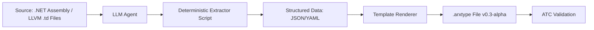

# dotnet-arxgen 与 llvm-arxgen 需求规格说明书

> 版本：v0.1-MVT
> 目标：为 Arxil MVT（最小可行工具链）提供自动化 .arxtype 生成能力

---

## 1. 总体目标

构建两套自动化工具——`dotnet-arxgen` 和 `llvm-arxgen`——用于从现有成熟生态（.NET BCL 与 LLVM）中提取类型、布局与操作信息，并生成符合 `.arxtype` v0.3-alpha 规范的契约文件。  
**核心原则**：  
> **LLM 仅用于理解源码结构并生成确定性提取脚本，绝不直接输出 `.arxtype` 内容。**

---

## 2. 系统架构

### 2.1 整体流程


### 2.2 核心组件职责

| 组件 | 职责 | 输出 |
|------|------|------|
| **LLM Agent** | 分析任务指令 → 定位关键源文件/节点 → 生成可执行提取脚本 | Python/JS 脚本（含注释） |
| **Extractor Runtime** | 在沙箱中执行脚本，调用反射/TableGen 工具 | 结构化数据（JSON） |
| **Template Renderer** | 将结构化数据渲染为标准 `.arxtype` | `.arxtype` 文件 |
| **ATC Hook** | （可选）自动调用 ATC 验证生成结果 | 验证报告 |

---

## 3. dotnet-arxgen 需求详述

### 3.1 输入
- **主输入**：.NET 程序集路径（如 `System.Runtime.dll`, `System.Numerics.dll`）
- **辅助输入**：
  - 目标类型列表（可选，如 `["Complex", "Vector2"]`）
  - 目标框架版本（如 `net6.0`, `net8.0`）

### 3.2 LLM Agent 能力要求
- **理解 ECMA-335 元数据模型**
- **识别以下元素**：
  - `struct` vs `class`（仅处理 `struct`）
  - `[StructLayout]` 属性（`Sequential`, `Explicit`, `Pack`）
  - 字段类型与名称
  - 静态方法（作为 `ops` 候选）
  - `[Intrinsic]`, `[MethodImpl(MethodImplOptions.AggressiveInlining)]` 等标记
- **映射规则**：
  - `System.Single` → `f32`
  - `System.Int32` → `i32`
  - `System.IntPtr` → `ptr_void`（需在 `interop` 中声明）

### 3.3 提取脚本规范（由 LLM 生成）
- **语言**：Python（使用 `pythonnet` 或 `Mono.Cecil`）
- **必须包含函数**：`def extract_<TypeName>_arxtype() -> dict`
- **输出字典结构**：
  ```json
  {
    "name": "Complex",
    "size_bits": 64,
    "fields": [
      {"type": "f32", "name": "Real", "offset_bits": 0},
      {"type": "f32", "name": "Imaginary", "offset_bits": 32}
    ],
    "ops": {
      "add": {
        "is_intrinsic": false,
        "operand_types": ["Complex", "Complex"]
      }
    },
    "has_pointer": true
  }
  ```

### 3.4 输出 `.arxtype` 要求
- 符合 v0.3-alpha EBNF
- 包含 `spec_version`、`core`、`layout`、`ops`、`interop`（如适用）
- `ops` 实现策略：
  - 若 `is_intrinsic == true` → 生成 `@x64 @asm { code = "..."; }`（占位符）
  - 否则 → 生成 `@instmm` 模板（调用基础类型操作）

### 3.5 覆盖范围（MVT 阶段）
| 类型 | 示例 |
|------|------|
| 基本数值 | `Int32`, `Single` |
| 数值结构体 | `Complex`, `DateTime` |
| SIMD 向量 | `Vector2`, `Vector4` |
| 指针包装 | `IntPtr`, `UIntPtr` |

---

## 4. llvm-arxgen 需求详述

### 4.1 输入
- **主输入**：LLVM 源码目录（含 `include/llvm/IR/Intrinsics.td`, `lib/Target/X86/X86InstrInfo.td`）
- **辅助输入**：
  - 目标向量类型（如 `v4f32`, `v2i64`）
  - 目标平台（如 `x86_64`, `aarch64`）

### 4.2 LLM Agent 能力要求
- **理解 TableGen 语法与语义**
- **识别以下元素**：
  - `defm` / `def` 定义的 intrinsic（如 `int_add`）
  - 指令定义中的寄存器类（`XMM`, `GPR`）、约束（`$src1, $src2`）
  - 功能标志（`HasSSE`, `HasNEON`）
- **映射规则**：
  - `v4f32` → `f32x4`
  - `addps` → `(f32x4)add`
  - `HasSSE` → `+sse`

### 4.3 提取脚本规范（由 LLM 生成）
- **语言**：Python（调用 `llvm-tblgen` 子进程或解析 `.td`）
- **必须包含函数**：`def extract_<Type>_<Op>_arxtype() -> dict`
- **输出字典结构**：
  ```json
  {
    "type": "f32x4",
    "op": "add",
    "asm_template": "addps %xmm0, %xmm1",
    "target": "x86_64",
    "features": ["sse"]
  }
  ```

### 4.4 输出 `.arxtype` 要求
- 为每个（类型, 操作, 平台）组合生成独立 `operands` 块
- 使用 `target_selector`：`@x86_64+sse`
- `code` 字段为汇编模板（保留寄存器占位符）

### 4.5 覆盖范围（MVT 阶段）
| 操作 | 类型 | 平台 |
|------|------|------|
| `add`, `sub`, `mul` | `f32x4`, `i32x4` | x86_64 (SSE) |
| `add`, `sub` | `f32x2`, `i64x2` | aarch64 (NEON) |
| 原子操作 | `i32` | x86_64 |

---

## 5. 共同非功能性需求

### 5.1 可靠性
- **LLM 输出必须经过 Schema 验证**（JSON Schema 定义脚本结构）
- **Extractor 脚本必须在沙箱中运行**（无网络、受限文件系统）
- **所有生成的 `.arxtype` 必须通过 ATC 基础检查**

### 5.2 可追溯性
- 每个 `.arxtype` 文件头部必须包含生成元信息：
  ```arxtype
  // Generated by dotnet-arxgen v0.1-MVT
  // Source: System.Numerics.Complex (net8.0)
  // LLM Prompt Template: dotnet-struct-v2
  // Extractor Script Hash: sha256:abc123...
  ```

### 5.3 可调试性
- 保留中间产物：
  - LLM 生成的脚本（`.py`）
  - Extractor 输出的 JSON
- 提供 `--debug` 模式，输出完整 pipeline 日志

### 5.4 可扩展性
- LLM prompt 模板可配置（YAML 文件）
- 支持新增“后端”（如未来 `rust-arxgen`）

---

## 6. 交付物

| 组件 | 交付形式 |
|------|--------|
| **LLM Agent Core** | Python 包（含 prompt 模板、schema validator） |
| **dotnet-arxgen CLI** | 可执行脚本（`dotnet-arxgen --assembly X.dll --output Y/`） |
| **llvm-arxgen CLI** | 可执行脚本（`llvm-arxgen --llvm-root Z/ --target x86_64 --output Y/`） |
| **示例资产** | 预生成的 `i32.arxtype`, `f32.arxtype`, `Complex.arxtype`, `f32x4.arxtype` |

---

## 7. 验收标准（MVT）

1. **功能**：
   - 能成功为 `System.Numerics.Complex` 生成合法 `.arxtype`
   - 能成功为 `f32x4` + `add` + `x86_64` 生成带 `@asm` 的 `.arxtype`
2. **质量**：
   - 所有输出通过 ATC v0.1 验证
   - 无 LLM 幻觉导致的字段偏移错误或类型错配
3. **工程**：
   - 工具可在 CI 中运行（Docker 镜像）
   - 生成过程 ≤ 5 分钟（单类型）

---

> **备注**：本需求文档聚焦 MVT 阶段。泛型、表达式偏移、嵌套字段等高级特性将在 v0.4+ 引入。