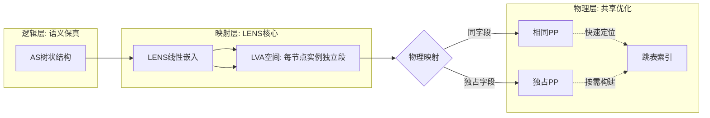

<!--
SPDX-FileCopyrightText: © 2025-2026 Bib Guake
SPDX-License-Identifier: LGPL-3.0-or-later
-->

# LENS Concept

*Linear Embedding of Node Structures with Skip Indexing*

---

> v0.2.1-drafting

---

---

## 引言

### 方案名称释义

**LENS**（透镜）既是对技术本质的精准概括，亦是富有深意的隐喻：
- **技术层面**：将树状AS结构“折射分解”到线性虚拟地址空间
- **哲学层面**：如同透镜不改变光线本质却优化其路径，LENS不破坏AS模型语义却优化其物理实现

---

## 核心设计原则

| 原则 | 实现 | 价值 |
|------|------|------|
| **语义保真** | 严格保持GVA-LVA偏移一致性 | Arxil编译器无需修改，指针安全转换 |
| **物理共享** | 多节点实例的相同字段映射至同一PP | 内存效率最大化，天然同步 |
| **逻辑独立** | 每个节点实例拥有连续且隔离的LVA段 | 程序视角简化，无绑定链解析开销 |
| **索引赋能** | 附加结构维护物理-逻辑映射 | 将O(n)操作降至O(k) |

---

## 架构概述

### 架构示意图

### 线性嵌入层（Linear Embedding）

- **节点实例地址分配**：
  - 每个节点实例分配连续LVA段（大小=节点模板定义）
  - 段内偏移严格对齐Arxil语法顺序（`meta_data`→`data`→`code`）
- **空间代价**：
  - LVA占用率提高
  - PTE条目增加
  - 分布式一致性协议的路径缓存条目增加
- **收益**：
  - 字段访问：`node_ptr->field` 为线性偏移计算，零元数据查询
  - 节点封闭：节点内合法指针值校验非常简单（单个线性范围），可以做到杜绝跨节点的指针越界

### 页共享层（Page Sharing）

- **物理映射策略**：
  | 字段类型 | 映射策略 | 同步机制 |
  |----------|----------|----------|
  | `ance`绑定字段 | 多VP→同一PP | 硬件MESI（同PM）/小页协议（跨PM） |
  | `publ`独立字段 | 每VP→独立PP | 无共享，无需同步 |
  | `priv`字段 | 每VP→独立PP+权限隔离 | 无共享 |

### 跳索引层（Skip Indexing）

- **结构**：
  - 按照特定数据结构，将映射到同一PP的多个VP关联起来
  - 这里的关键是VP对PP的映射是允许**不对齐**的，且映射到同一PP的多个VP也允许不对齐，因此会呈现类似于跳表的结构，指示多个VP之间的关联
- **构建**：
  - **按需扩展**：层级随关联VP数量动态增长
  - **位置**：放置在专门VA区间（例如高值区间）