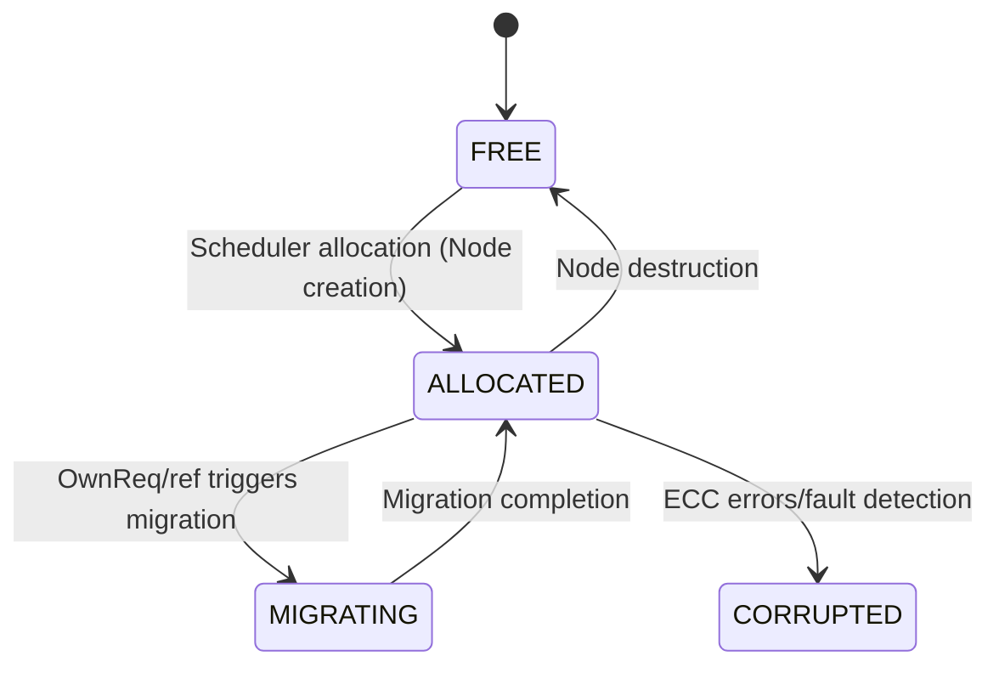

<!--
SPDX-FileCopyrightText: © 2025 Bib Guake
SPDX-License-Identifier: LGPL-3.0-or-later
-->

# 2.1 Memory Subsystem

---

> v0.1.3-drafting

---

- [2.1 Memory Subsystem](#21-memory-subsystem)
  - [2.1.0 引言](#210-引言)
    - [2.1.0.1 设计愿景](#2101-设计愿景)
  - [2.1.1 Physical Layer](#211-physical-layer)
    - [2.1.1.1 Ontology of the Physical Page (PP)](#2111-ontology-of-the-physical-page-pp)
    - [2.1.1.2 PP Near-Storage Metadata](#2112-pp-near-storage-metadata)
    - [2.1.1.3 Segmented Storage Layout](#2113-segmented-storage-layout)
      - [2.1.1.3.1 DRAM Segments](#21131-dram-segments)
      - [2.1.1.3.2 SSD Segments](#21132-ssd-segments)
      - [2.1.1.3.3 Tail Segments](#21133-tail-segments)
    - [2.1.1.4 Metadata Reliability and Fault Tolerance](#2114-metadata-reliability-and-fault-tolerance)
    - [2.1.1.5 Physical Memory Management Policy](#2115-physical-memory-management-policy)
  - [2.1.2 Virtual Address Space Model](#212-virtual-address-space-model)
    - [2.1.2.1 Global Virtual Address (GVA)](#2121-global-virtual-address-gva)
      - [2.1.2.1.1 GVA Structure and Allocation Policy](#21211-gva-structure-and-allocation-policy)
      - [2.1.2.1.2 GVA NSME: Self-Bootstrapping Distributed Metadata](#21212-gva-nsme-self-bootstrapping-distributed-metadata)
        - [Conservative Approximate Jump Pointers](#conservative-approximate-jump-pointers)
        - [Self-Bootstrapping Access Protocol](#self-bootstrapping-access-protocol)
      - [2.1.2.1.3 Local Continuity Between GVA and LVA](#21213-local-continuity-between-gva-and-lva)
      - [2.1.2.1.4 GVA Lifecycle and Fault Recovery](#21214-gva-lifecycle-and-fault-recovery)
    - [2.1.2.2 Local Virtual Address (LVA)](#2122-local-virtual-address-lva)
      - [2.1.2.2.1 LVA Semantics and Constraints](#21221-lva-semantics-and-constraints)
      - [2.1.2.2.2 LVA Allocation and Free-Space Management](#21222-lva-allocation-and-free-space-management)
      - [2.1.2.2.3 LVA NSME: Metadata for Address Intervals](#21223-lva-nsme-metadata-for-address-intervals)
        - [Key Design Principles:](#key-design-principles)
      - [2.1.2.2.4 Coordination Between LVA and Page Table (PTE)](#21224-coordination-between-lva-and-page-table-pte)
    - [2.1.2.3 Ontology of Virtual Pages (VP)](#2123-ontology-of-virtual-pages-vp)
      - [2.1.2.3.1 Essence of VP: Abstract Object for Data](#21231-essence-of-vp-abstract-object-for-data)
      - [2.1.2.3.2 Dual Embedding Views: LVA vs. GVA](#21232-dual-embedding-views-lva-vs-gva)
      - [2.1.2.3.3 Containment Relationship: VP and PP](#21233-containment-relationship-vp-and-pp)
        - [Migration Semantics](#migration-semantics)
      - [2.1.2.3.4 Copy Mechanism and Consistency](#21234-copy-mechanism-and-consistency)
      - [2.1.2.3.5 Structural Relationships Between VP, AS, and Node](#21235-structural-relationships-between-vp-as-and-node)
      - [2.1.2.3.6 State Machine of VP](#21236-state-machine-of-vp)
  - [2.1.3 逻辑层](#213-逻辑层)
    - [2.1.3.1 AS 生命周期](#2131-as-生命周期)
    - [2.1.3.2 节点语义](#2132-节点语义)
    - [2.1.3.3 共享机制](#2133-共享机制)
      - [2.1.3.3.1 CARN（Cross AS Referring Node）](#21331-carncross-as-referring-node)
      - [2.1.3.3.2 共享代码段（Shared Code Node, SCN）](#21332-共享代码段shared-code-node-scn)
    - [2.1.3.4 CoW（Copy-on-Write）机制](#2134-cowcopy-on-write机制)
  - [2.1.4 容错与错误处理](#214-容错与错误处理)
    - [2.1.4.1 故障恢复](#2141-故障恢复)
    - [2.1.4.2 ECC 与数据完整性](#2142-ecc-与数据完整性)
  - [2.1.5 内存压力管理](#215-内存压力管理)
    - [2.1.5.1 驱逐策略](#2151-驱逐策略)
    - [2.1.5.2 转移存储](#2152-转移存储)
    - [2.1.5.3 资源硬边界](#2153-资源硬边界)
  - [2.1.6 调试与可观测性](#216-调试与可观测性)
    - [2.1.6.1 PP 层接口](#2161-pp-层接口)
    - [2.1.6.2 VP 层接口](#2162-vp-层接口)
    - [2.1.6.3 AS/Node 层接口](#2163-asnode-层接口)
    - [2.1.6.4 全局接口](#2164-全局接口)
    - [2.1.6.5 安全验证](#2165-安全验证)


---

## 2.1.0 引言

### 2.1.0.1 设计愿景
- 显式分布式（Explicitly Distributed）
- 局部自组织，全局稳态

---

## 2.1.1 Physical Layer

The physical layer constitutes the foundational substrate of the EDSOS memory subsystem, responsible for managing raw storage units on physical devices—such as DDR DRAM modules and NVMe SSDs. Its primary objective is to **deliver scalable, reliable, and hardware-friendly physical page management with minimal overhead**, while enabling the *containment* relationship that underpins virtual pages (VPs) in the upper layers.

### 2.1.1.1 Ontology of the Physical Page (PP)

A **Physical Page (PP)** is the atomic unit of the physical layer, defined as a fixed-size, contiguous block of storage on a single physical device. Crucially, a PP is **stateless, unowned, and semantically empty**—it functions solely as a *container* that may hold one VP at a time.

- **No intrinsic content management**: The state and semantics of a PP are entirely externalized via metadata.
- **Containment semantics**: In steady state, a VP resides in exactly one PP. During migration, it may transiently exist in two PPs simultaneously; external consistency is guaranteed by the coherence protocol.
- **Device binding**: Each PP is strictly bound to a single physical storage device (e.g., one DDR5 DIMM or one SSD). **Segment boundaries never span across distinct physical devices**.

> **Design philosophy**: By being “headless,” the PP becomes a pure resource pool. This enables the scheduler to freely allocate, migrate, or reclaim PPs without modifying the PP itself—aligning with EDSOS’s principle of *explicit distribution* and *loading-time centrality*.

### 2.1.1.2 PP Near-Storage Metadata

Each PP is described by a **PP Near-Storage Metadata Entry (PP NSME)**, an 8-byte (64-bit) compact structure encoding its state and topological attributes:

| Field               | Width | Description |
|---------------------|-------|-------------|
| `state`             | 6 bits | Page state: `FREE=0`, `LOCKED=1`, `CORRUPTED=2`, `RELIABLE=3`, `RESERVED=4`, … |
| `next_free_log2`    | 6 bits | Logarithmic hint for free-list jump distance (base-2 scale) |
| `jump_hint_prev`    | 19 bits | Conservative approximation of predecessor offset in hierarchical free list |
| `jump_hint_next`    | 19 bits | Conservative approximation of successor offset in hierarchical free list |
| `ded`               | 1 bit  | Parity bit for fast hardware integrity check of the PP NSME |
| `zone_token`        | 4 bits | Zone identifier for NUMA or storage-type (DRAM/SSD) optimization |
| `reserved`          | 9 bits | Reserved for future extensions (e.g., security tags, compression state, ECC mode) |

The PP NSME supports an O(log d) allocation/deallocation algorithm based on *Conservative Logarithmic Jump Hints*. The jump pointers are conservative approximations (computed position ≤ true position), ensuring correctness through unidirectional linear probing during lookup.

### 2.1.1.3 Segmented Storage Layout

To organize PP NSMEs efficiently and eliminate pointer overhead, physical memory is partitioned into **Segments**:

- Segment size: Logically **2 GiB** ($2^{31}$ bytes).
- Metadata region: The first **4 MiB** of each segment, composed of two 2-MiB **metadata pages**.
- Data region: The remaining $2\,\text{GiB} - 4\,\text{MiB}$, divided into PPs according to device-native page granularity.
- Indexing: The PP NSME for the $i$-th PP within a segment resides at byte offset $i \times 8$ in the metadata pages—**no explicit address pointers are stored**.

#### 2.1.1.3.1 DRAM Segments
- PP size: **4 KB**, aligned with CPU page size.
- Number of PPs: $(2\,\text{GiB} - 4\,\text{MiB}) / 4\,\text{KiB} = 523{,}264$.
- Metadata capacity: A 2-MiB metadata page holds $2^{19} = 524{,}288$ PP NSMEs, leaving ~1,024 entries reserved for:
  - Segment-level metadata (e.g., lock, usage tag, hardware info);
  - Cross-segment indices (e.g., free-segment lists);
  - Alignment padding to accommodate vendor-specific capacity reporting (e.g., base-1000 vs. base-1024).

#### 2.1.1.3.2 SSD Segments
- **PP size**: **16 KB**, matching typical SSD write granularities.
- **Fewer PPs per segment**, with **more reserved PP NSME slots**.
- **Write-amplification mitigation**: Since 16-KB updates underutilize the 2-MB metadata page, PP NSME writes are **rotated across subregions** of the metadata page to distribute wear and extend SSD lifetime.

#### 2.1.1.3.3 Tail Segments
- If a physical device’s capacity is not an exact multiple of 2 GB, the remainder forms a **tail partial segment**.
- Tail segments use simplified metadata management:
  - Metadata pages are proportionally smaller;
  - Free-list traversal degrades to **linear scan**, which remains acceptable due to small scale.

> **Important note**: Segments are purely organizational units for PP NSMEs and do **not constrain higher-layer allocations**. For example, a 1-GiB large page may span two segments, requiring coordinated updates to PP NSMEs in both. This incurs only negligible additional memory latency and preserves correctness.

### 2.1.1.4 Metadata Reliability and Fault Tolerance

- **Hardware ECC as primary defense**: Both PP NSMEs and PP data rely on device-native error correction (e.g., DDR5 On-Die ECC, SSD LDPC).
- Software ECC as optional fallback: Disabled by default. If enabled, it requires **dedicated physical regions** for parity storage—no space is reserved by default.
- **Metadata page backup**:
  - Critical segments may configure backup copies of their metadata pages;
  - Backups can be co-located (e.g., in a dedicated metadata zone) or randomly dispersed (to improve fault isolation);
  - A backup is accessed via a pointer stored in the segment header and is only used upon failure of the primary metadata page.

### 2.1.1.5 Physical Memory Management Policy

- Allocation/deallocation: Driven exclusively by the scheduler, leveraging the hierarchical jump-list in PP NSMEs for O(log d) complexity.
- **No global garbage collector**: The content clearance and space reuse of PP occurs only through explicit scheduling decisions, avoiding unpredictable latency from implicit collection.
- **Hard PPSUC boundary**: Each physical machine (PM) enforces a hard limit on physical capacity—**Physical Paged Storage Unit Capacity (PPSUC)**. **Cross-PM PP borrowing is prohibited**, ensuring locality and performance predictability.
- Fault handling: A PP marked as `CORRUPTED` (due to uncorrectable ECC errors or metadata checksum failure) is permanently isolated and excluded from future allocations.

---

## 2.1.2 Virtual Address Space Model

### 2.1.2.1 Global Virtual Address (GVA)

The **Global Virtual Address (GVA)** is a 128-bit logical identifier used in EDSOS to uniquely name a **Virtual Page (VP) that is accessible across physical machines (PMs)** within the cluster. Aligned with the principle of *explicit distribution*, a GVA is allocated **only when a VP becomes visible beyond its local PM**—for example, upon remote reference, sharing, or migration. VPs that remain strictly private to a single PM do not require a GVA, thereby avoiding unnecessary global naming overhead.

GVA and Local Virtual Address (LVA) together form EDSOS’s two-level address model:
- **LVA** is a 64-bit virtual address used internally by an Arbor Strux (AS) for CPU execution and pointer arithmetic. It is always bound to a specific PM.
- **GVA** serves as a cluster-wide logical ID, enabling DPU-driven coherence protocols, remote access, and fault recovery.

These two address spaces are linked via **local continuity**: for any given VP, the offset between its base and any internal pointer is identical in both LVA and GVA. Formally,
$$
\text{GVA}_{\text{ptr}} = \text{GVA}_{\text{base}} + (\text{LVA}_{\text{ptr}} - \text{LVA}_{\text{base}})
$$
This invariant ensures that applications can safely convert local LVA-based pointers into GVAs for DPU communication without violating program semantics. Critically, the lifetimes and allocation policies of GVA and LVA are fully decoupled: LVAs are allocated at AS creation time and remain stable, whereas GVAs are allocated lazily on first cross-PM use.

#### 2.1.2.1.1 GVA Structure and Allocation Policy

A GVA is structured as follows:

```
[ RefIdx:16 ][ Free Bits:112 ]
```

- **`RefIdx` (16 bits)**: Identifies the replica index of the referenced VP. `RefIdx = 0` denotes the canonical copy; `RefIdx > 0` indicates a ref copy. This field is assigned by the DPU during a `ref` operation and **does not encode physical location**.
- **`Free Bits` (112 bits)**: Encodes the logical identity of the VP. While uninterpreted by hardware, this field is *guideline-partitioned* as:
  ```
  [ initPMID:16 ][ LocalGVA:96 ]
  ```
  - **`initPMID`**: A hint for the initial owner PM ID, used solely to **reduce contention during GVA allocation**. The allocator preferentially attempts allocation within the current PM’s `initPMID` range; if unsuccessful, it may search globally. **This field does not determine the VP’s actual location.**
  - **`LocalGVA`**: A high-order logical offset, typically aligned with the upper bits of the corresponding LVA to support local continuity.

> **Important Note**: The GVA bit layout **encodes no physical location information**. The true owner PM of any GVA is dynamically indicated by the `pmid` field in its associated **GVA Namespace Metadata Entry (GVA NSME)**. This complete decoupling of naming from placement enables arbitrary VP migration without GVA modification.

#### 2.1.2.1.2 GVA NSME: Self-Bootstrapping Distributed Metadata

Each GVA is associated with a **GVA NSME**, which stores metadata about the VP’s state, size, ownership, and allocation topology. Crucially, GVA NSMEs themselves reside in the GVA address space, forming a **self-bootstrapping metadata structure**.

The GVA NSME format is defined as:

| Field                        | Width | Description |
|-----------------------------|-------|-------------|
| `state`                     | 4     | VP state: `FREE` / `ALLOCATED` / `RESERVED` / `OTHER` |
| `pmid`                      | 16    | ID of the PM currently holding the VP’s page table entry (PTE) |
| `next_diftype_log2`         | 7     | Logarithmic step size hint for primary-space traversal |
| `diftype_jump_hint_prev`    | 14    | Conservative backward jump delta for primary-space skip list |
| `diftype_jump_hint_next`    | 14    | Conservative forward jump delta for primary-space skip list |
| `frefidx_jump_hint_prev`    | 3     | Conservative backward jump delta for free RefIdx list |
| `frefidx_jump_hint_next`    | 3     | Conservative forward jump delta for free RefIdx list |
| `lock`                      | 3     | Lightweight spin lock (1 bit) + contention flags (2 bits) |

##### Conservative Approximate Jump Pointers

To enable efficient allocation and deallocation, GVA NSMEs employ **conservative approximate jump pointers**:
- **Primary-space jumps (14 bits)**: Encoded as `(k:11, t:3)`, yielding an approximate offset of $(2^k) \times 2^{(2^t)}$, indexing into a GVA NSM Page (which contains $2^{19}$ VP entries).
- **Free RefIdx jumps (3 bits)**: Encoded as $s$, yielding an approximate offset of $4^{(2^s)}$.

All jumps represent **deltas**, and all approximations are **conservative**: the computed position is guaranteed to be ≤ the true target. Consequently, lookups require only **forward linear probing** with never backward traversal, ensuring correctness and implementation simplicity.

##### Self-Bootstrapping Access Protocol

At boot time, the system pre-allocates a small set of GVA NSM Pages (metadata pages), whose GVAs and initial `pmid`s are hard-coded by the bootloader. To access the GVA NSME of any GVA:
1. Compute the GVA of its containing NSM Page using high-order bits;
2. Recursively resolve GVA NSMEs of the NSM Page to obtain its `pmid`;
3. Issue a DPU read request to the PM identified by `pmid`;
4. The target PM’s DPU returns the specific GVA NSME entry.

This process is fully distributed, requires no central directory, and supports lazy GPA mapping—the PTE for an GVA NSME may be marked as absent, with the scheduler populating it on demand.

#### 2.1.2.1.3 Local Continuity Between GVA and LVA

To preserve application semantics, EDSOS enforces a strict **local continuity constraint**: within any contiguous region of VPs, the offset between base and pointer must be identical in both GVA and LVA. This ensures that:
- Compiler-generated pointers (based on LVA) can be safely converted to GVAs at runtime;
- DPU instrumentation code can directly compute remote data locations as `(GVA_base + offset)`;
- Applications require no source-level modifications to operate correctly in a distributed setting.

This invariant is jointly maintained by the loader and scheduler:
- The loader allocates contiguous LVA regions for each AS;
- The scheduler aligns GVA allocation to the LVA base on first `ref`;
- Subsequent operations (e.g., `fork`, `divide`) preserve LVA layout stability, thereby maintaining GVA–LVA mapping consistency.

#### 2.1.2.1.4 GVA Lifecycle and Fault Recovery

- **Allocation**: Triggered by the scheduler when a VP is first referenced across PMs, via allocation from the GVA NSME free list.
- **Deallocation**: Occurs when all `ref` references are released (`unref`) and the VP is destroyed; the GVA NSME state is set to `FREE` and returned to the free list.
- **Fault Recovery**: If the PM indicated by `pmid` fails, the DPU detects the failure via heartbeat timeout and initiates:
  1. Cleanup of stale paths (`dpu_cleanup_pm_refs`);
  2. Election of a new owner PM among existing replicas;
  3. Update of the GVA NSME’s `pmid` field by the new owner, completing metadata handover;
  4. The GVA itself remains unchanged during failure, ensuring **reference transparency**.

---

### 2.1.2.2 Local Virtual Address (LVA)

The **Local Virtual Address (LVA)** constitutes the **sole address space visible to CPU execution** in EDSOS. It adheres to the standard 64-bit virtual addressing format. It is translated by the local MMU into Local Physical Addresses (LPAs) via conventional multi-level page tables (PTEs). This design ensures full compatibility with existing x86-64 and ARM64 address translation mechanisms. The LVA model preserves familiar OS programming semantics while enabling key Arbor Strux (AS) features: node-scoped isolation, structured concurrency, and subtree-aware execution.

#### 2.1.2.2.1 LVA Semantics and Constraints

- **AS Privacy**: Each AS (analogous to a process in classical OS models) owns a private LVA space, rooted at a dedicated page table whose base is loaded into the CR3 register. LVAs from distinct ASes are semantically disjoint—even if numerically identical, they refer to unrelated memory regions. Switching between ASes is accomplished by updating CR3.

- **Node Contiguity**: All Virtual Pages (VPs) belonging to a single Node—comprising metadata (R), executable code (RX), and mutable data (RW)—must reside within a **contiguous LVA region**. This requirement enables:
  - Compiler-generated relative jumps and data offsets;
  - Pointer validity and transitivity within the AS;
  - Efficient subtree scoping via PTE Present-bit manipulation.

- **Address Stability**: Once allocated, an LVA remains valid for the entire lifetime of its AS. Addresses are **never reclaimed or reused**, ensuring long-lived application pointers remain safe.

- **Address Width**: The usable virtual address width is up to 57 bits, providing ample headroom for foreseeable workloads.

> The LVA represents the *execution view* of memory. It exists independently of the Global Virtual Address (GVA); a GVA is assigned only when a VP must be referenced across physical machines (PMs).

#### 2.1.2.2.2 LVA Allocation and Free-Space Management

LVA allocation is triggered by the scheduler during AS creation or Node operations. The allocator must satisfy the following constraints:
- Align allocations to node granularity (typically ≥ 4 KB);
- Guarantee contiguity of the R/RX/RW segments within each Node;
- Insert at least one 4 KB guard page between adjacent Nodes to prevent spatial overruns.

To efficiently manage the vast 48–57 bit virtual address space, EDSOS introduces **LVA NSMEs** as lightweight descriptors enabling O(log N) free-block search and coalescing, which is different from Linux’s VMA-based red-black trees.

#### 2.1.2.2.3 LVA NSME: Metadata for Address Intervals

Each LVA NSME is a compact **64-bit (8-byte)** record that describes the lifetime and topological attributes of an LVA interval. It complements—but does not duplicate—the information in PTEs:
- **PTEs** describe *pages*: their LPA mapping, permissions, huge-page status, and SSD residency.
- **NSMEs** describe *address ranges*: whether they are allocated, lockable, or eligible for sharing.

The LVA NSME layout is defined as follows:

| Field                | Width   | Description |
|----------------------|---------|-------------|
| `state`              | 4 bits  | Interval state:<br>`0=FREE`, `1=LOCKED` (allocation in progress), `2=CORRUPTED`, `3=RELIABLE`, `4=RESERVED` |
| `next_diftype_log2`  | 6 bits  | Primary jump-step hint for hierarchical free-list traversal |
| `jump_hint_prev`     | 19 bits | Conservative backward offset to predecessor in jump list (≤ true distance) |
| `jump_hint_next`     | 19 bits | Conservative forward offset to successor in jump list (≤ true distance) |
| `lock`               | 2 bits  | Lightweight spinlock for concurrent allocation on multi-core PMs |
| `flags`              | 6 bits  | Extended flags (stored here due to limited OS-reserved bits in PTEs):<br>• `IS_NODE_BOUNDARY`<br>• `SSD_BACKED_HINT`<br>• `NO_REF` (disallows cross-PM referencing) |
| `counter`            | 8 bits  | Performance counter (e.g., access frequency, page-fault count) for scheduler-driven eviction |

##### Key Design Principles:
1. **No Page-Size Encoding**: Page size (4K/2M/1G) is solely the responsibility of the PTE. The NSME tracks only whether an address range is *in use*, not how it is paged.
2. **Conservative Jump Hints**: The `jump_hint_prev/next` fields store *conservative under-approximations* of pointer offsets. This guarantees that free-space searches require only unidirectional linear probing.
3. **Multi-Core Safety**: The `lock` field serializes concurrent modifications to the same NSME, supporting parallel AS execution across cores.
4. **Observability for Scheduling**: The `counter` field enables heat-based eviction and migration policies by the scheduler.

#### 2.1.2.2.4 Coordination Between LVA and Page Table (PTE)

Physical mapping of LVAs is handled entirely through standard PTEs. EDSOS leverages **OS-reserved bits** in the PTE (e.g., bits 58–62 on x86-64) to encode extended semantics:
- `IN_SSD`: Indicates the LPA resides on SSD, requiring special I/O handling on access;
- `SUBTREE_ROOT`: Marks the PTE as the root of a subtree, enabling incremental page-table updates during scope transitions;
- `CARN_REF`: Denotes that the VP participates in a CARN (Cross-AS Reference Namespace), permitting shared writable access across ASes.

These annotations are interpreted by software upon page faults and do not rely on hardware support.

> **Note**: PTEs describe *pages*, whereas LVA NSMEs describe *address intervals*. For example, a single 2 MB huge page corresponds to one PTE but spans multiple LVA NSME entries, each covering a 4 KB-aligned sub-interval of the larger region.

---

### 2.1.2.3 Ontology of Virtual Pages (VP)

In the EDSOS memory subsystem, a **Virtual Page (VP)** serves as the **fundamental logical abstraction unit** for data encapsulation. It is not a physical entity but an **abstract object** with distinct identity, state, and behavioral semantics. A VP's existence is independent of its physical container (PP) or indexing method (LVA or GVA), yet it must be associated with both to be instantiated and accessed.

#### 2.1.2.3.1 Essence of VP: Abstract Object for Data

The core definition of VP is as follows:

> **A VP is a fixed-size (4K/2M/1G) abstract object with globally recognizable identity. It carries no execution semantics and functions purely as a data abstraction.**

Key characteristics:
- **Unique Identity**: A VP is uniquely identified by `{ASID, LVA}` within its AS context; if cross-PM visibility is required, it also possesses a GVA.
- **No Built-in Reference Counting**: Unlike traditional systems, VPs do not maintain reference counts. Their existence is binary:
  - **Non-existent/unallocated**;
  - **Exist and unique** (allocated and owned by a Node).
- **Bound to a Single AS**: Each VP strictly belongs to one AS and cannot be shared across ASes unless explicitly duplicated via the **CARN (Cross-AS Referring Node)** mechanism.

> **Philosophical Clarification**: VPs are considered "objects" rather than "resources". Their usage is achieved through creating copies or obtaining access rights to the canonical copy instead of incrementing refcounts.

#### 2.1.2.3.2 Dual Embedding Views: LVA vs. GVA

While VPs themselves have no inherent address, they can be "embedded" into address spaces through two orthogonal views:

| View | User | Purpose | Mandatory |
|------|------|---------|-----------|
| **LVA** | Local CPU | Index for local read/write operations in the private virtual address space | Yes (all VPs must have an LVA) |
| **GVA** | DPU | Index for remote access in the cluster-wide logical namespace | No (only assigned when cross-PM visibility is needed) |

- **LVA View**: Embeds the VP into the AS's private virtual address space, forming contiguous node layouts;
- **GVA View**: Embeds the VP into a cluster-level logical namespace, supporting path caching and consistency protocols.

These views **do not bind the VP itself but index the same VP instance from different dimensions**, akin to embedding an abstract manifold into various coordinate systems ($\mathbb{R}^n$). The VP represents the manifold, while LVA and GVA serve as coordinate charts.

> **Critical Implication**: Modifying LVA mappings (e.g., remapping to SSD) or GVA routing (e.g., migrating owner_pm) **does not alter the VP itself**, only changes how it is accessed.

#### 2.1.2.3.3 Containment Relationship: VP and PP

For a VP to be instantiated and accessible, it must be contained within a physical entity, referred to as **Containment**:

- **PP (Physical Page)** is the smallest unit of physical storage (a continuous segment of DDR or SSD);
- **At any given time, a VP resides in exactly one PP** (except during transient migration phases);
- **Copies of a VP reside in separate PPs**, ensuring physical isolation.

##### Migration Semantics
"Migration of VP" involves switching its containment relationship from one PP to another, accomplished through remapping of GVA and LVA:
1. Source PM transfers VP data to target PM;
2. Update `pmid` field in GVA NSME;
3. Mark source PM’s LVA PTE as page fault;
4. Establish new LVA → LPA mapping on target PM;
5. Update DPU *Path Cache* (DPU cache of communication path description of VPs) via `PCEReq/PCEAck`.

> **Boundary Case**: During migration, the VP may temporarily exist in both source and target PPs ("dual containment"), but consistency protocols ensure external observers see consistent states.

#### 2.1.2.3.4 Copy Mechanism and Consistency

VP supports the creation of **copies (ref copy)** for cross-PM sharing or load migration. Key attributes of copies include:
- **Dependence on Canonical Copy**: Validity of copies relies on the canonical copy (RefIdx=0);
- **Independent Identities**: Each copy has its own LVA (within the target AS) and GVA (RefIdx > 0);
- Data Consistency: Two orthogonal protocols are designed:
  - **Path-Caching Consistency Protocol**: Eventual consistency, supporting optimistic reads/writes;
  - **Ownership Protocol**: Strong consistency, used for locking or migration scenarios.

> **Important Note**: Copies are not references but **new VP instances**, whose contents synchronize with the canonical copy through data consistency protocols.

#### 2.1.2.3.5 Structural Relationships Between VP, AS, and Node

VPs act as **atomic building blocks** for constructing AS address spaces, with higher-level structures providing their semantic context:

| Structure | Relation to VP |
|-----------|----------------|
| **Node** | Organizational unit for VPs; contains several **contiguous LVA VPs** (R/RX/RW segments) |
| Special Node **CARN (Cross-AS Referring Node)** | Allows cross-AS sharing; its VPs can be referenced by other ASes to create copies |

- **VPs lack structural semantics**: Individual VPs do not know which Node they belong to or whether they are part of a CARN;
- **Structural semantics maintained by scheduler**: Node metadata records VP ranges, types, and sharing policies;
- **VP lifecycle is part of Node lifecycle**: Node destruction leads to all its VPs being marked FREE and LVA NSME recycling.

> **Design Principle**: VPs are "headless" data pages whose structure is defined by Nodes and managed by DPUs.

#### 2.1.2.3.6 State Machine of VP

Throughout its lifecycle, a VP transitions through the following states (described by GVA NSME.state or LVA NSME.state, which should remain consistent):



- **ALLOCATED**: VP exists, contained in a PP, and is accessible;
- **MIGRATING**: Transient state where data is being copied, potentially blocking or redirecting accesses;
- **CORRUPTED**: Irrecoverable error requiring upper-layer handling.

---

## 2.1.3 逻辑层

### 2.1.3.1 AS 生命周期
- 创建：初始化 LVA 空间元数据（页表基址）
- 销毁：释放 LVA 元数据，触发所有 VP unref

---

### 2.1.3.2 节点语义
- **三段结构**：元数据（R）、指令（RX）、数据（RW）
- **定义域**：可访问的 VP 集合（自身 + 祖先）
- **作用域**：自身 VP 可被哪些节点访问
- **引用计数**：仅 CARN/SCN 具备

---

### 2.1.3.3 共享机制

#### 2.1.3.3.1 CARN（Cross AS Referring Node）
- **唯一可跨 AS 共享的节点类型**
- **引用计数**：由 CARN 元数据维护
- **一致性**：
  - 同 PM：链式消息总线 或 硬件原子锁（显式调用）
  - 跨 PM：DPU 路径缓存 / 所有权协议（显式桩函数）

#### 2.1.3.3.2 共享代码段（Shared Code Node, SCN）
- **退化 CARN**：仅含只读指令段
- **复用 CARN 引用计数与 PTE 配置机制**
- **不可迁移、不可写**

---

### 2.1.3.4 CoW（Copy-on-Write）机制
- **触发条件**：fork 后写入共享 VP
- **PTE 标记**：只读 + CoW 标志位（OS 保留位）
- **缺页处理**：
  - 调度器分配新 PP
  - 复制原内容
  - 更新写入 AS 的 VP → 新 PP
- **CARN 特例**：
  - fork 时 **引用计数 +1**，AS B 正常共享 CARN
  - 写入时 **取消 CoW，允许直接写**（因 AS B 合法持有引用）
  - 若 AS B 不需要，应显式取消引用

---

## 2.1.4 容错与错误处理

### 2.1.4.1 故障恢复
- PM 失效检测：DPU 心跳/超时
- 所有权接管：各个副本自我票选新正本
- 路径自动清理：`dpu_cleanup_pm_refs`

---

### 2.1.4.2 ECC 与数据完整性
- **硬件 ECC**：DPU 传输校验 + CPU 内存 ECC（默认）
- **软件 ECC**：应急接口 `enable_software_ecc(vp)`（默认关闭）

---

## 2.1.5 内存压力管理

### 2.1.5.1 驱逐策略
- **单位**：节点（因 VP 绑定于节点）
- **热度预测**：
  - 就绪队列等待时间
  - 事件阻塞时长
  - AS 树拓扑邻近性
- **动作**：调度器主动解除 VP 对 PP 的盛装

---

### 2.1.5.2 转移存储
- **SSD PP**：PPSUC 包含高速磁盘可用
- **流程**：调度器将 VP 迁移到 SSD PP → 访问时按需重迁移

---

### 2.1.5.3 资源硬边界
- **抛出失败**：无空闲 PP 且迁移超时 → 返回“内存不足”
- **禁止跨 PM 分配**

---

## 2.1.6 调试与可观测性

### 2.1.6.1 PP 层接口
- `pp_status(pp_id)`
- `pp_snapshot(gpa_range)`

---

### 2.1.6.2 VP 层接口
- `vp_info(tsid, lva)`
- `vp_trace_start/stop(tsid, lva)`

---

### 2.1.6.3 AS/Node 层接口
- `ts_layout(tsid)`
- `ctrn_refs(ctrn_lva)`
- `node_scope(node_lva)`

---

### 2.1.6.4 全局接口
- `dpu_message_log(pm_id)`
- `scheduler_decision_log(core_id)`
- `chain_bus_stats()`

---

### 2.1.6.5 安全验证
- `check_lva_overflow(tsid)`
- `verify_vp_consistency(gva)`
